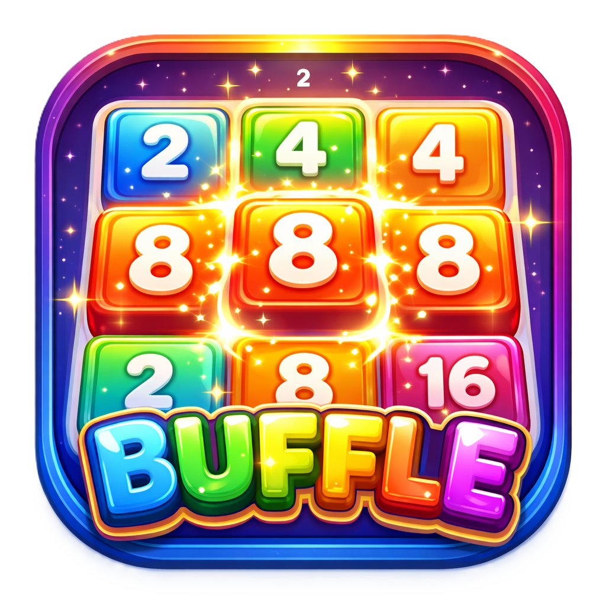

# Buffle

    

Buffle is a lightweight 2048-like puzzle game where you move and combine matching blocks to upgrade them and score points. The goal is to keep merging blocks to reach higher-tier pieces and achieve the best score before no moves remain.

## How to play

- Move blocks using arrow keys or WASD (or swipe/touch on mobile).
- Match 3 or more identical blocks to merge them into an upgraded block and earn points.
- Chains and larger merges give higher scores.
- The game ends when there are no valid moves left.
- On the Game Over screen press `R` to restart.

## Controls

- Arrow keys/WASD/Mouse/Touch: move blocks.
- R: restart on game over.

## Running locally

- Run `npm install` and `npm run dev`.
- Access the game at `http://localhost:5173`

## Project structure

### Lib

- **src/game.ts** Main game loop (init, draw, update, reset)
- **src/controls.ts** Controls binding logic
- **src/animation/** Animation engine
- **src/gui/** In-game GUI widgets to compose primitives (grid, blocks, text)
- **src/components/** Web component UI elements (game over, leaderboard)

### API

- **src/auth/** Authentication and Storage setup module
- **src/api.ts** Networking/Storage/Leaderboard submit helpers

### Game Logic

- **src/movement.ts** Block movement logic
- **src/matcher/** Block matching logic
- **finalize.ts** Game over wiring logic

## Contributing

- Bug reports and PRs welcome. Follow repository coding style and include tests for logic changes.
